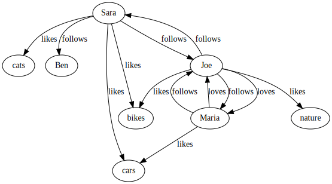
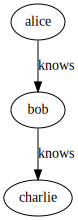

graphagus
=========

TIP: A nice version of this document is at http://baach.de/graphagus/README.html.

*graphagus* is a graph database, a very thin layer on top of ZODB. 

It actually provides what neo4j calls a 'property graph', e.g.  the nodes and 
edges can have properties. These can be indexed for fast access.

All in all graphagus seems to be reasonably fast. In my tests (from python) it is faster then e.g. neo4j or mysql for my requirements.

NOTE: graphagus doesn't use zope, just zodb and repoze.catalog. Optionally ZEO of course. And to render the graph graphviz can be used.

* github: https://github.com/jhb/graphagus
* pypi: https://pypi.python.org/pypi/graphagus

This text and graphagus are: (c) 2014, Joerg Baach, mail@baach.de, GPL

Quick Overview
--------------

Setup
~~~~~

With ZODB one can either use a database directly, or use ZEO for Server mode. Both work fine, here we use the direct mode, without ZEO. We use a MemoryStorage as a backend for the examples here (the usual other alternatives are possible as well, e.g. FileStorage):

[source, python]
----
>>> import graphagus
>>> g = graphagus.getGraph() 

----

Creating the graph
~~~~~~~~~~~~~~~~~~

Ok, now lets populate the database with a first example. It follows http://docs.neo4j.org/chunked/stable/cypher-cookbook-multirelational-social-network.html

[source,python]
----

>>> cats =   g.addNode(name='cats')
>>> nature = g.addNode(name='nature')
>>> ben =    g.addNode(name='Ben')
>>> sara =   g.addNode(name='Sara')
>>> bikes =  g.addNode(name='bikes')
>>> maria =  g.addNode(name='Maria')
>>> cars =   g.addNode(name='cars')
>>> joe =    g.addNode(name='Joe')

>>> e1 =  g.addEdge(sara,joe,'follows')
>>> e2 =  g.addEdge(sara,ben,'follows')
>>> e3 =  g.addEdge(sara,bikes,'likes')
>>> e4 =  g.addEdge(sara,cars,'likes')
>>> e5 =  g.addEdge(sara,cats,'likes')
>>> e6 =  g.addEdge(maria,joe,'follows')
>>> e7 =  g.addEdge(maria,joe,'loves')
>>> e8 =  g.addEdge(maria,cars,'likes')
>>> e9 =  g.addEdge(joe,sara,'follows')
>>> e10 = g.addEdge(joe,maria,'follows')
>>> e11 = g.addEdge(joe,maria,'loves')
>>> e12 = g.addEdge(joe,bikes,'likes')
>>> e13 = g.addEdge(joe,nature,'likes')

# We can render the graph to an image
>>> #g.render('graphagus')

----

The rendered graph looks like this:

Querying
~~~~~~~~
Ok, so lets query our graph. We use some higher level APIs here.

[source,python]
----

#lets 'wrap' joe as a more functional node
>>> joe = g.node(joe)

#Query people that joe follows or loves, and that have the same relationship back to him

#This means finding edges of certain types going out from joe, and checking if an edge of the same type is going reverse
>>> result = [e for e in joe.outgoing(('loves','follows')) #get edges of specified types 
...                   if g.getEdges(e.target,joe,e.type)]  #and check if there is a similar backlink

#Now we can print the result
>>> for edge in result:
...    print edge.target.name, edge.type
Sara follows
Maria follows
Maria loves

>>> joe.outgoing('loves')[0].target==maria
True

----

And now that we are finished with the example, lets clean out the whole
database:

[source,python]
----

>>> g.clean()

----

Architecture
------------

Graphagus started out as a silly idea, while evaluating performance claims on neo4j (https://baach.de/Members/jhb/neo4j-performance-compared-to-mysql). The silly idea led to some more python/ZODB/pickling performance measurements, and inspired the following design.

Nodes
~~~~~

Nodes are entries in an IOBTree, which means that an integer (the node id) is pointing to a dictionary. The dictionary contains the properties of the node. So the most simple entry looks like this:

[source, python]
g.nodes[1] = {}

or, with a bit more data like this:
[source,python]
g.nodes[2] = {'name':'Second Node'}

This is what nodes look like on the lowest level. Usually within graphagus one actually uses 'lightNodes'. This is just a funky name for the node dictionary with the node's id added under the '_id' key:

[source,python]
g.lightNode(2) == {'_id':2,'name':'Second Node'}

This makes handling the nodes way easier internally. 

Edges
~~~~~

Edges are the more interesting bit. Their basic structure is list with three entries:

[source,python]
g.edges[1] = [1,2,1]

This is an edge connecting source node 1 with target node 2, and the edge is of the edgetype 1. There is an object containing the mapping of 'type names' to edgetypes:

[source,python]
g.typeids.friend = 1

If you want to store properties on an edge, these props get stored within a  dictionary, which is then placed into another IOBTree

[source,python]
g.edgedata[1] = {'duration':'5 years'}

As with the nodes there is a 'lightEdge' structure, which is what you usually get when using the lower level APIs:

[source,python]
g.lightEdge(1) == [1, 2, 1, {'duration':'5 years'},1]

So, it is the basic edge structure (source,target,type) extended by the properties, and the internal id.

Graph directories
~~~~~~~~~~~~~~~~~

Given the above structure one would have no way to directly find edges from one node to the other. But fear not! There are two 'directories' that help the lookup. They have a very similar structure:

[source,python]
----
g.outgoing[typeid][source] = {edgeid:target, ...}
g.incoming[typeid][target] = {edgeid:source, ...}

----

With the examples above, we would have generated the following entries:

[source,python]
----
g.outgoing[1][1] = {1:2}
g.incoming[1][2] = {1:1}

----

When doing "just" graph traversal, usually those directory entries are all that is needed. E.g. when finding nodes that link to node 2 using typeid 1, one could use:

[source,python]
nodeids = g.incoming[1][1].values()

IMPORTANT: Sticking to these directories as much as possible is the key to doing very fast queries, because one avoids unpickling of the edges and nodes. 

Indexing
--------

In order to search nodes or edges, as shown in the examples below, one needs to setup up indexes on specific properties. These indexes are setup in the catalogs:

node_catalog::
    For indexing the nodes
edge_catalog::
    For indexing the edges

The catalog and indexing machinery comes from the fine 'repoze.catalog' project, so please check there for more details: http://docs.repoze.org/catalog/. 

Within graphagus we have to little helpers, 'Nodegetter' and 'Edgegetter', which will basically return the value of the specified attribute. 

Setting up indexes is optional, but we use them later on in this tutorial (see <<searching,searching>>, <<finding,finding>>), so lets set them up right now.

[source,python]
----
>>> g.node_catalog['name'] =  graphagus.CatalogFieldIndex(graphagus.Nodegetter('name'))
>>> g.node_catalog['text'] =  graphagus.CatalogTextIndex(graphagus.Nodegetter('text'))

>>> g.edge_catalog['since'] = graphagus.CatalogFieldIndex(graphagus.Edgegetter('since'))
>>> g.edge_catalog['text'] =  graphagus.CatalogTextIndex(graphagus.Edgegetter('text'))

>>> g.node_catalog['name']
<repoze.catalog.indexes.field.CatalogFieldIndex object at ...>

----

IMPORTANT: From now on, whenever nodes or edges are added to the graph, they are automatically cataloged and indexed using these indexes.

Please also check the section on <<searching,searching>> nodes and <<finding,finding>> edges.

Nodes
-----

This section shows how to deal with nodes.

Creating
~~~~~~~~
Lets create some nodes:

[source,python]
----
>>> alice = g.addNode(name='alice')
>>> bob = g.addNode(name='bob',lastname='The Builder')

# lets have a look at alice
>>> alice == { '_id': 1, 'name': 'alice'}
True

# and at bob
>>> bob == {'_id': 2, 'lastname': 'The Builder', 'name': 'bob'}
True

----

+alice+ and +bob+ are +lightnodes+. This is a dictionary with the properties
of the node, plus the additional internal +_id+. +Lightnode+ is what you 
usually work with. To illustrate:

[source,python]
----
>>> g.nodes[1]
{'name': 'alice'}

>>> alice == { '_id': 1, 'name': 'alice'}
True

>>> alice != g.nodes[1]
True

----

There is a little wrapper method +lightNode+, which will return a +lightnode+ object,
that is a dict with the +_id+ set, and either fetch a node from the db, or just
copy values over:

[source,python]
----
# it will either fetch a copy of the node...
>>> alice2 = g.lightNode(1)

# they have the same value
>>> alice == alice2
True

# but are not the same object
>>> id(alice) == id(alice2)
False

# ..., or, with a dict as a second parameter, only the _id will be set
# in the copy of the dict

>>> d = {}
>>> dictid = id({})
>>> out = g.lightNode(333,d)
>>> out
{'_id': 333}
>>> id(out) != dictid
True

----

Updating
~~~~~~~~

[source,python]
----
>>> bob['text'] = 'this is some wonderful text'
>>> g.updateNode(bob)

#thats all. Lets confirm

>>> bob2 = g.lightNode(bob['_id'])
>>> bob2 == bob
True

----

anchor:searching[]

Searching
~~~~~~~~~

How do you get nodes from the database?

[source,python]
----
# using fulltext
>>> nodes = g.queryNode(text='wonder*')
>>> nodes[0] == bob
True

# or the other index that we configured
>>> nodes = g.queryNode(name='alice')
>>> nodes[0] == alice
True

# No index, no search
>>> nodes = g.queryNode(lastname='The Builder')
Traceback (most recent call last):
    ...
KeyError: 'lastname'

----

Deleting 
~~~~~~~~

[source,python]
----
>>> charlie = g.addNode(name='charlie')
>>> g.delNode(charlie)

----

Edges
-----

Where we learn all about connecting nodes.

Creating
~~~~~~~~

Let's create a simple edge

[source,python]
----
>>> e1 = g.addEdge(alice,bob,'knows')
>>> e1
[1, 2, 1, {}, 1]

----

Lets add charlie again, and a link with extra data

[source,python]
----
>>> charlie = g.addNode(name='charlie')
>>> e2 = g.addEdge(bob,charlie,'knows',since=2012)
>>> e2
[2, 4, 1, {'since': 2012}, 2]

----

The returned data is the in the form of [source,target,type,attributes,edgeid]. It is a +lightEdge+. 

There is a helper method to quickly get the type name of an edge
[source,python]
----
>>> g.getType(e2)
'knows'

----

anchor:finding[]

Finding
~~~~~~~

Lets find some edges.

[source,python]
----

#if we know the edge id, its quite easy
>>> tmp = g.lightEdge(2)
>>> tmp == e2
True

#alternatively we can use the catalog
>>> res = g.queryEdge(since=2012)
>>> len(res)
1
>>> res[0] == e2
True

# the most basic api for getting edges
>>> tid = g.typeid('knows')
>>> r = g.outgoing[tid][alice['_id']]

# the data is a dict of the form {edgeid:nodeid}
>>> r
{1: 2}

# edge e1 has id 1 ...
>>> e1[4]
1

#starts at node 1 (alice)
>>> e1[0]
1

>>> alice['_id']
1

#...going to node 2 (bob)
>>> e1[1]
2

>>> bob['_id']
2

# it works the other way around as well
>>> g.incoming[tid][bob['_id']]
{1: 1}

----

There is a more comfortable api, which is less direct (hence slower), but probably much more usable.

[source,python]
----
# a bit higher level up is the following
>>> r = g.getAllEdges(alice['_id'],'o')
>>> r[0] == e1
True

>>> r = g.getAllEdges(bob['_id'],'i')
>>> r[0] == e1
True

#or, a bit simpler
>>> r = g.getAllEdges(bob,'i')
>>> r[0] == e1
True

#or get all edges
>>> r = g.getAllEdges(bob)

#incoming
>>> r.i[0]==e1
True

#outgoing
>>> r.o[0]==e2
True

----

Updating
~~~~~~~~

[source,python]
----
>>> e2[3]['since']=2011
>>> e2
[2, 4, 1, {'since': 2011}, 2]

----

Deleting
~~~~~~~~
[source,python]
----

#lets create another extra node
>>> eve = g.addNode(name='eve')

#and connect to it
>>> e3 = g.addEdge(bob,eve,'knows')

# first off, you can't delete a connected node
>>> g.delNode(eve)
Traceback (most recent call last):
    ...    
StillConnected: ('incoming', {3: 2})

#so, lets delete the edge
>>> g.delEdge(e3)

#are there still incoming edges on eve?
>>> g.getAllEdges(eve,'i')
[]

#So, lets remove Eve
>>> g.delNode(eve)

#It seems that did work ok

----

Higher Level API
----------------

There is a slightly higher level API. We already used that in the introductionary examples.

As a reminder, the graph currently looks like this:

[source, python]
>>> #g.render('example1')

anchor:getAllEdges[]

graph.getAllEdges
~~~~~~~~~~~~~~~~~

[source,python]
g.getAllEdges(self,nodeids,directions=None,types=None)

Returns connected edges for one or more nodes, optionally filtered by type. The edges are returned as 'Edge' objects.

* _nodeids_ - can be a single or list of  integer, lightNode or Nodes (or mixed)
* _directions_ - can be either a string starting with "i" or "o", or an iterable with both of them. Defaults to ("incoming","outgoing"). If both (or none) are given, will return a dict-like object that has an "i" and "o" keys as well as attributes
* _types_ - can be a single or list of edgetypes, given as ints or strings

[source, python]
----

>>> g.getAllEdges(bob,'incoming')
[Edge([1, 2, 1, {}, 1])]

#abbriviate
>>> g.getAllEdges(bob,'i')
[Edge([1, 2, 1, {}, 1])]

>>> g.getAllEdges(bob,'outgo')
[Edge([2, 4, 1, {'since': 2011}, 2])]

#directions default to ("incoming","outgoing")
>>> g.getAllEdges(bob)
{'i': [Edge([1, 2, 1, {}, 1])], 'o': [Edge([2, 4, 1, {'since': 2011}, 2])]}

#key and attribute
>>> g.getAllEdges(bob)['i'] == g.getAllEdges(bob).i
True

#multiple nodes
>>> g.getAllEdges((bob,charlie),'i')
[Edge([1, 2, 1, {}, 1]), Edge([2, 4, 1, {'since': 2011}, 2])]

----

Edge
~~~~

A lightEdge can be wrapped as a full 'Edge' object.

[source,python]
>>> edge = g.edge(e2)

This object has the following attributes and methods

* _source_: the source node as a 'Node'
* _target_: the target node as a 'Node'
* _type_: the type as a 'str'
* _data_: the data dict of the node
* _.foo_: the value of _foo_ in the data dict (raises 'AttributeError')

[source,python]
----
>>> edge.source
Node({'lastname': 'The Builder', '_id': 2, 'name': 'bob', 'text': 'this is some wonderful text'})

>>> edge.target
Node({'_id': 4, 'name': 'charlie'})

>>> edge.type
'knows'

>>> edge.data
{'since': 2011}

>>> edge.since
2011

----

Node
~~~~

A lightNode can be wrapped as a full 'Node' object

[source,python]
>>> node = g.node(bob)

This object has the following attributes and methods:

* _allEdges(directions=None,types=None)_: returns Edges as in the corresponding g.getAllEdges(node,...) call. See <<getAllEdges,graph.getAllEdges>>
* _outgoing_: (types=None) returns a list of outgoing edges, filtered by type
* _o_: shorthand for _outgoing_
* _incoming_: (types=None) returns a list of incoming edges, filtered by type
* _i_: shorthand for _incoming_
* _.foo_: the value of _foo_ in the data dict (raises 'AttributeError')

[source,python]
----
>>> node.allEdges()
{'i': [Edge([1, 2, 1, {}, 1])], 'o': [Edge([2, 4, 1, {'since': 2011}, 2])]}

>>> node.outgoing(types='knows')
[Edge([2, 4, 1, {'since': 2011}, 2])]

>>> node.o
[Edge([2, 4, 1, {'since': 2011}, 2])]

>>> node.incoming(types='unknown')
[]

>>> node.i
[Edge([1, 2, 1, {}, 1])]

>>> node.name
'bob'

----

Performance comparison
----------------------

I did some performance measurements on graphagus. They are done within a comparison of graphagus and neo4j (because that's where the id for this project comes from).

https://baach.de/Members/jhb/neo4j-performance-compared-to-graphagus

[source,python]
>>> #import ipdb; ipdb.set_trace()
