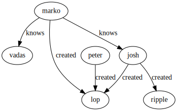

[source,python]
----

>>> import graphagus
>>> import traversal
>>> from traversal import T
>>> g = graphagus.getGraph()

>>> marko  = g.addNode(label='person',name='marko',age=29)
>>> vadas  = g.addNode(label='person',name='vadas', age=27)
>>> lop    = g.addNode(label='software',name='lop',lang='java')
>>> josh   = g.addNode(label='person',name='josh', age=32)
>>> ripple = g.addNode(label='software',name='ripple', lang='java')
>>> peter  = g.addNode(label='person',name='peter',age=35)
>>> e1 = g.addEdge(marko,vadas,'knows',weight=0.5)
>>> e2 = g.addEdge(marko,josh,'knows',weight=1.0)
>>> e3 = g.addEdge(marko,lop,'created',weight=0.4)
>>> e4 = g.addEdge(josh,ripple,'created',weight=1.0)
>>> e5 = g.addEdge(josh,lop,'created',weight=0.4)
>>> e6 = g.addEdge(peter,lop,'created',weight=0.2)

>>> g.render('traversal')

----
The rendered graph:

[source,python]
----

>>> t = traversal.getTraverser(g)
>>> t.N()
[1, 2, 3, 4, 5, 6]

>>> marko['_id']
1

>>> t.N(1).values('name')
['marko']

>>> t.N(1)
[1]

>>> t.N(1).outE('knows')
[1, 2]

>>> t.N(1).outE('knows').inN()
[2, 4]

>>> t.N(1).outE('knows').inN().values('name')
['vadas', 'josh']

>>> t.N(1).out('knows').values('name')
['vadas', 'josh']

>>> t.N(1).out('knows').has(age=lambda x:x>30).values('name')
['josh']

>>> t.N(1).outE('knows').has(weight=t.gt(0.6)).inN().values('name')
['josh']

>>> t.N(1).out('knows').out('created').values('name')
['ripple', 'lop']

>>> [n.upper() for n in t.N(1).out('knows').out('created').values('name')]
['RIPPLE', 'LOP']

>>> t.N(1).out('knows').has(age=32).values('name')
['josh']

>>> t.N(1).out('created')._in('created').values('name')
['marko', 'josh', 'peter']

>>> creators = [c for c in t.N(1).out('created')._in('created') if c < 6]
>>> T(g,creators).values('name')
['marko', 'josh']

